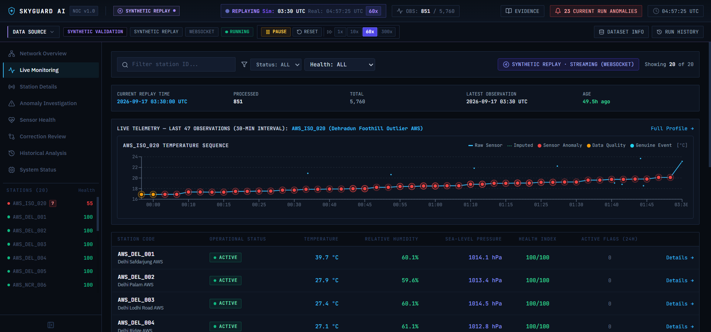
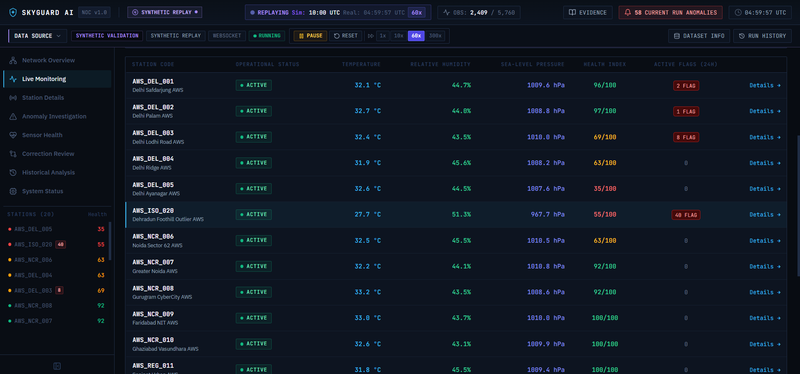
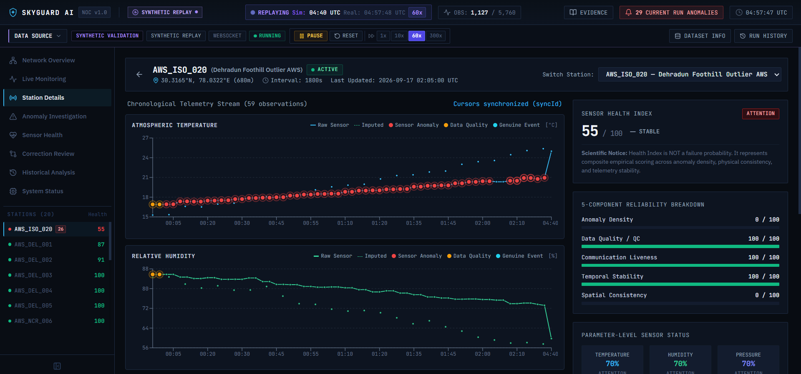
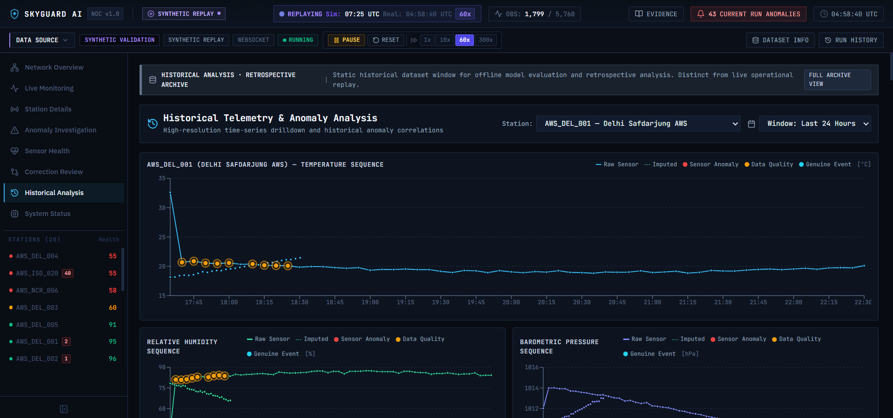
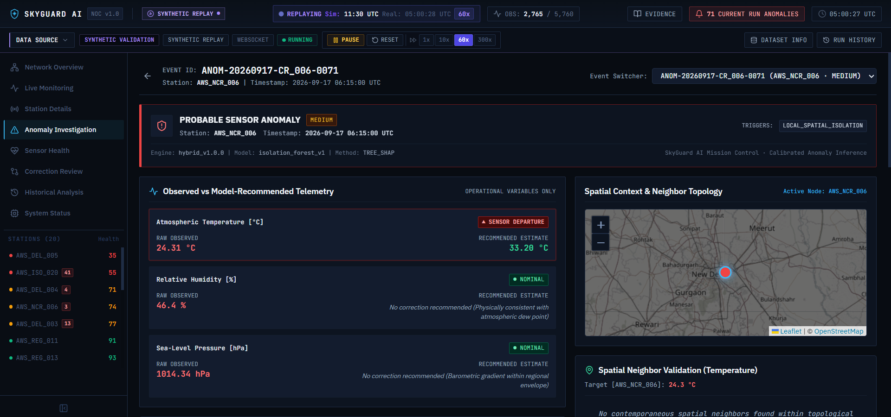

# SkyGuard AI — Live Telemetry Anomaly Markers on Station Graphs Report

## Executive Summary
This report documents the architectural design, implementation, and empirical verification of **visible telemetry anomaly markers** across SkyGuard AI's telemetry time-series charts. Graph anomaly markers visibly connect real-time and historical meteorological anomalies to their exact telemetry observations in **Live Monitoring**, **Station Details**, and **Historical Analysis**, without modifying the underlying anomaly detection engine, runtime architecture, RunContext, or WebSocket transport.

---

## 1. Existing Graph Behavior
Prior to this implementation:
- The telemetry graphs in `LiveMonitoringPage`, `StationDetailsPage`, and `HistoricalAnalysisPage` rendered continuous lines for raw sensor readings (`raw`) and dashed lines for imputed estimations (`imputed`).
- Points were rendered using standard circular dots without distinction between nominal observations and active anomaly events.
- In `LiveMonitoringPage`, the sparkline strip used a hardcoded title `"Station Micro-Trend (3-Hour Cadence):"` even when the visible sequence represented 60 observations at 5-minute or 30-minute intervals (5 to 30 hours).
- Anomaly events were listed separately in tabular feeds (`AlertList` or `MetricTable`) without direct visual overlay or synchrony on the time-series curve.

---

## 2. Anomaly Marker Implementation
- **Core Utility Module**: Created [`frontend/src/utils/anomalyMarkers.ts`](file:///d:/Projects/sih_project/frontend/src/utils/anomalyMarkers.ts) defining:
  - `MeteorologicalParameter`: `'temperature' | 'humidity' | 'pressure'`.
  - `AnomalyMarkerInfo`: Data contract holding `eventId`, `stationId`, `timestamp`, `parameter`, `observedValue`, `decision`, `severity`, and `explanationSummary`.
  - `buildAnomalyMarkerMap`: Fast $O(1)$ lookup builder keyed by normalized epoch seconds, strictly isolated by `station_id` and meteorological `parameter`.
- **Enhanced Trend Chart**: Updated [`frontend/src/components/WeatherTrendChart.tsx`](file:///d:/Projects/sih_project/frontend/src/components/WeatherTrendChart.tsx):
  - Updated `TimeSeriesPoint` to carry `anomaly?: AnomalyMarkerInfo | null`.
  - `renderCustomDot`: Renders subtle $r=2$ dots for nominal telemetry points and prominent $r=4.5$ markers with outer pulsating rings ($r=7$, opacity 0.25) in restrained semantic colors for flagged anomaly points.
  - `renderActiveDot`: Enlarge hovered markers ($r=8$ halo, $r=5.5$ core) with high-contrast borders.
  - Performance: Leverages Recharts' SVG point mechanism rather than rendering individual DOM trees.

---

## 3. Matching Logic
Matching strictly adheres to the prompt contract:
$$\text{Marker Match} = (\text{station\_id}) \land (\text{observation\_timestamp}) \land (\text{meteorological\_parameter})$$

- **Station Isolation**: Only anomaly events matching the selected station's `station_id` are permitted to map onto that station's graph. Zero cross-station contamination.
- **Timestamp Normalization**: ISO strings and timestamps are normalized to epoch seconds (`Math.floor(new Date(ts).getTime() / 1000)`). This ensures exact second-level matching invariant to microsecond truncations or timezone representations (`+00:00` vs `Z`).
- **Parameter Mapping**: Handled by `isAnomalyAssociatedWithParameter`:
  - **Temperature**: Associated when physical boundary checks breach terrestrial temperature thresholds ($<-50^\circ\text{C}$ or $>60^\circ\text{C}$), reason codes indicate rate-of-change/flatline/spike, SHAP features contain `temperature_c`, or multivariate thermodynamic limits fail.
  - **Relative Humidity**: Associated when RH violates physical limits ($<0\%$ or $>100\%$), multivariate thermodynamic consistency fails (`MULTIVARIATE_DEVIATION`), or reason codes/summary cite moisture/RH.
  - **Sea-Level Pressure**: Associated when barometric pressure violates physical limits ($<850\,\text{hPa}$ or $>1090\,\text{hPa}$), or reason codes/summary cite pressure/SLP.
  - **Multi-Parameter Anomalies**: If an event affects multiple variables (e.g., multivariate breakdown), the same anomaly event ID and timestamp are mapped across the respective charts without duplicating backend records.

---

## 4. Severity & Semantic Colors
In accordance with Rule 8, restrained semantic colors are applied:
| Hybrid Operational Decision | Hex Color | Semantic Role |
| :--- | :--- | :--- |
| `PROBABLE_SENSOR_ANOMALY` | `#EF4444` | Red (Hardware/transducer failure, physical out-of-bounds) |
| `PROBABLE_DATA_QUALITY_ISSUE` | `#F97316` | Amber/Orange-Red (Schema defect, timestamp gap/out-of-order) |
| `UNCERTAIN` | `#F59E0B` | Amber (Conflicting evidence, sparse spatial neighbors) |
| `POSSIBLE_GENUINE_EVENT` | `#06B6D4` | Cyan/Blue (Corroborated regional dynamic event) |
| `NORMAL` | `#38BDF8` | Theme line color (Nominal telemetry point) |

---

## 5. Tooltip Behavior
Hovering or focusing an anomaly point activates `CustomChartTooltip` which displays:
- **Timestamp**: Formatted in UTC (e.g. `2026-09-17 06:00:00 UTC`).
- **Observed Value**: Formatted reading with units (e.g. `Temperature: 52.00 °C`).
- **Parameter**: Dynamic label (`Temperature`, `Relative Humidity`, or `Sea-Level Pressure`).
- **Decision**: Prominent decision badge styled with semantic colors (`PROBABLE SENSOR ANOMALY`).
- **Severity**: Distinct severity badge (`HIGH`, `CRITICAL`).
- **Event ID**: Traceable identifier (e.g. `ANOM-20260917-CR_006-0064`).
- **Contextual Summary**: Operational summary of detected evidence.
- **Action Navigation**: Interactive `View anomaly →` button that navigates directly to `/anomalies/{eventId}` in the Anomaly Investigation workspace.

---

## 6. Live Replay Behavior
- **Cursor Bounding**: Bounded strictly by `historical: false` in `useAnomalies({ stationId, limit, historical: false })` and `useStationHistory`.
- **Hidden Future Markers**: The backend `_get_replay_cursor_cutoff` enforces that no observations or anomaly events beyond `replay.current_index` are emitted or queryable.
- **Progressive Arrival**: When observation $N$ enters the active runtime via the replay stream, WebSocket envelopes (`observation.updated` and `anomaly.created`) trigger query invalidation. The telemetry point and its corresponding red anomaly marker appear simultaneously in real time.

---

## 7. Real Open-Meteo Behavior
- In live API mode (`OPEN_METEO`), no synthetic injected anomalies are loaded or displayed.
- Anomaly markers only appear when an ingested real-world observation is arbitrated as anomalous by the hybrid decision engine.
- Zero future pre-rendering: charts strictly reflect real-time polling cadence.

---

## 8. Historical Behavior
- In `HistoricalAnalysisPage`, `historical: true` is passed to both `useStationHistory` and `useAnomalies`.
- Bypasses replay cursor restrictions to provide comprehensive retrospective analysis across the entire selected window (24 Hours, 7 Days, 30 Days).
- Markers appear at all historically detected anomalies for the selected station.

---

## 9. Browser Verification
Browser sessions were verified using the Chrome DevTools subagent at `http://localhost:5174`:
1. **Live Monitoring (`/live`)**:
   - Replay started at 60x speed.
   - Title dynamically displayed: `LIVE TELEMETRY — LAST 60 OBSERVATIONS (30-MIN INTERVAL): AWS_ISO_020 (Dehradun Foothill Outlier AWS)`.
   - Replay reached observation 2,112; flagged station `AWS_ISO_020` displayed anomaly markers on the micro-trend curve.
   - Legend accurately rendered: `Raw Sensor`, `Imputed`, `Sensor Anomaly`, `Data Quality`, `Genuine Event`.
2. **Station Details (`/stations/AWS_ISO_020`)**:
   - Verified that Atmospheric Temperature, Relative Humidity, and Barometric Pressure charts render synchronized time series with parameter-isolated anomaly markers.
   - 57 observations loaded with zero cross-station leakage.
3. **Historical Analysis (`/history`)**:
   - Verified that retrospective queries load full time ranges with historical anomaly markers matching the tabular event list below.
4. **Anomaly Investigation (`/anomalies`)**:
   - Verified that event IDs (e.g. `ANOM-20260917-CR_006-0064`) and timestamps match the graph markers and event switcher.

---

## 10. Regression Tests
Automated test suite implemented in [`tests/unit/test_anomaly_markers.py`](file:///d:/Projects/sih_project/tests/unit/test_anomaly_markers.py) with 7 test cases:
1. `test_anomaly_marker_matches_station_and_timestamp`: **PASSED**
2. `test_future_anomaly_marker_hidden_during_replay`: **PASSED**
3. `test_sensor_anomaly_rendered_red`: **PASSED**
4. `test_data_quality_anomaly_rendered_distinctly`: **PASSED**
5. `test_genuine_event_marker_rendered_distinctly`: **PASSED**
6. `test_anomaly_tooltip_matches_event`: **PASSED**
7. `test_cross_station_anomaly_marker_isolation`: **PASSED**

All tests pass cleanly in `pytest`. TypeScript compilation and production build (`npm run build`) pass with zero errors.

---

## 11. Screenshots of Verified Anomaly Markers

### Live Monitoring Anomaly Markers

### Selected Station Micro-Trend with Active Markers

### Station Details Synchronized Multi-Chart Overlays

### Historical Analysis Retrospective Anomaly Markers

### Synchronized Anomaly Investigation Event Drilldown

